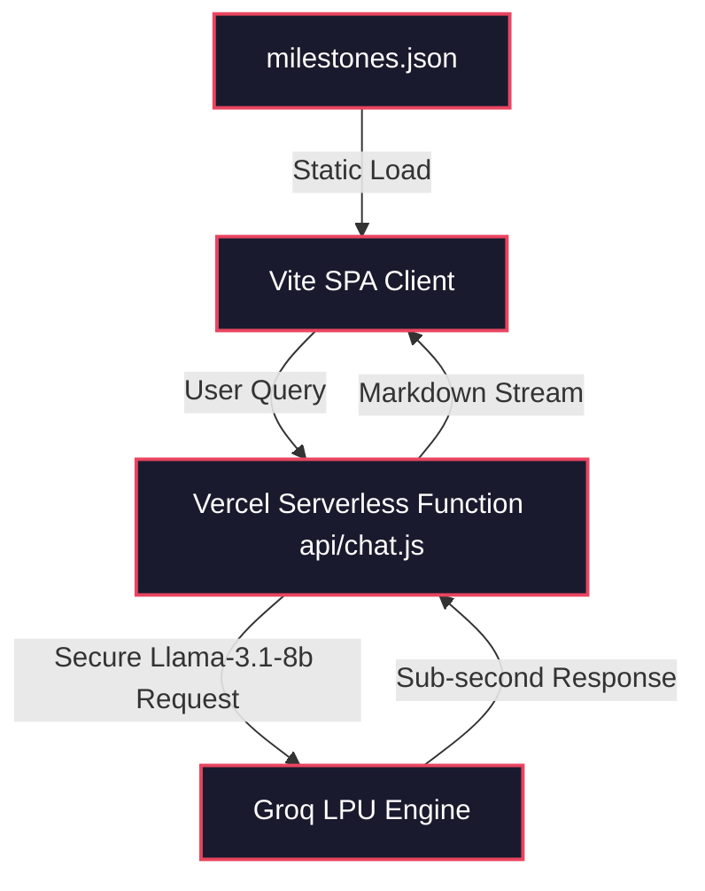
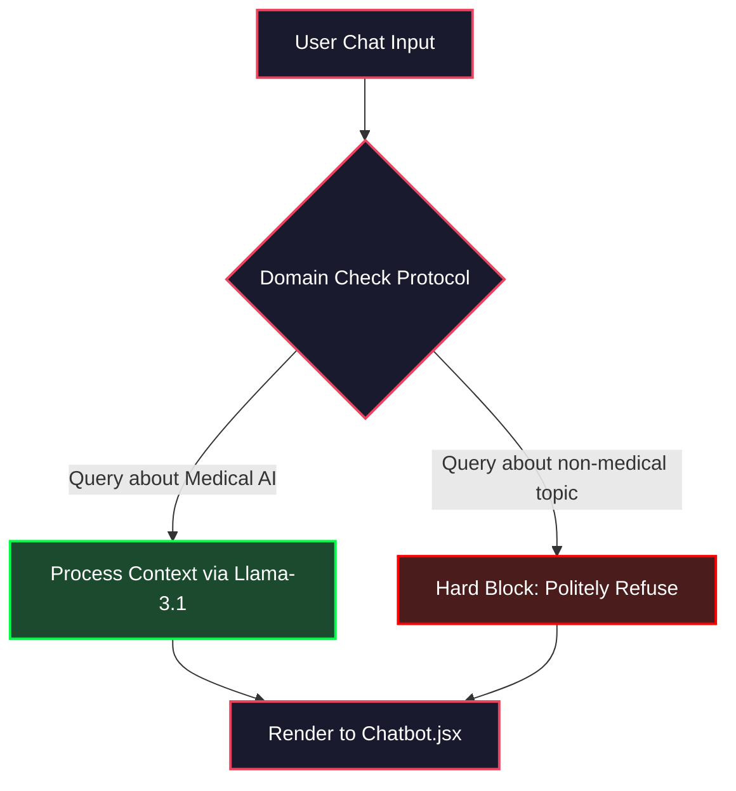
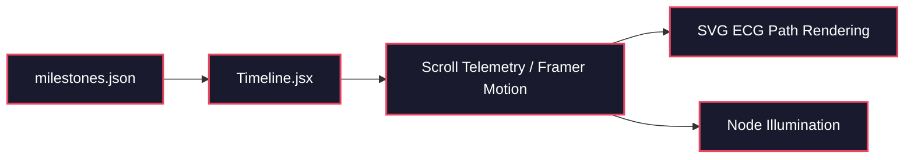

# Evolution of AI in Healthcare (2000–2026)

An interactive, cinematic digital documentary tracking the transformation of medical AI over the past 26 years. Built for educators, researchers, and stakeholders, it fuses high-fidelity web physics with an ultra-low-latency clinical historian LLM.

**Engineering Philosophy:** *Cinematic performance, absolute domain restriction, and sub-second LPU inference at the edge.*

---

## Table of Contents
- [1. System Architecture](#system-architecture)
- [2. Pipeline Overview](#pipeline-overview)
- [3. Component Registry](#component-registry)
- [4. Schema Registry](#schema-registry)
- [5. Project Structure](#project-structure)
- [6. Setup and Configuration](#setup-and-configuration)
- [7. Running the System](#running-the-system)
- [8. API Reference](#api-reference)
- [9. Evaluation Framework](#evaluation-framework)
- [10. Design Philosophy](#design-philosophy)
- [11. Safety Mechanisms](#safety-mechanisms)
- [12. Known Limitations](#known-limitations)
- [13. Remaining Work and Roadmap](#remaining-work-and-roadmap)
- [14. Technology Stack](#technology-stack)
- [15. License](#license)

---

## System Architecture

The application is structured as a decoupled Single Page Application (SPA) utilizing Vite and React 18 for high-performance rendering. The core UX relies heavily on Framer Motion's `useScroll` telemetry to drive the rendering of timeline nodes. To prevent credential leakage, the frontend communicates with the Groq inference engine via a secure Vercel Serverless Function proxy.

### High-Level Pipeline


### Oracle.AI Decision Gate Flowchart


### Data Flow Between Modules


**Key Constraint Guarantee:** The system guarantees strict domain adherence; the embedded Oracle.AI LLM is categorically blocked from engaging with queries outside the domain of healthcare AI.

---

## Pipeline Overview

| Phase | Module | Purpose | Input | Output |
| :--- | :--- | :--- | :--- | :--- |
| **Initial Load** | `App.jsx` | Orchestrate layout and load states. | Static bundle | Rendered DOM, 3D Canvas initialization |
| **Scroll Physics** | `Timeline.jsx` | Map scroll position to visual state. | User Y-Axis Scroll | SVG `strokeDashoffset`, Node opacity |
| **Data Parsing** | `milestones.json` | Supply historical event data. | Local JSON | Structured JS Objects |
| **Inference Proxy** | `api/chat.js` | Secure API keys and proxy request. | Chat JSON body | LLM Response string |

---

## Component Registry

| Component | File | Method/Endpoint | LLM Usage | Deterministic Logic |
| :--- | :--- | :--- | :--- | :--- |
| **Timeline Engine** | `src/components/Timeline.jsx` | Client Render | None | Scroll mapping, `useSpring` physics |
| **Oracle.AI** | `src/components/Chatbot.jsx` | Client Render | Yes (Formatting) | Markdown parsing, UI state |
| **Future Forecast** | `src/components/FutureForecast.jsx`| Client Render | None | Static branch rendering logic |
| **3D Background** | `src/components/ThreeBackground.tsx`| WebGL Canvas | None | Particle math (`maath/random`) |
| **Serverless Proxy**| `api/chat.js` | `POST /api/chat` | Yes (Groq Inference) | System prompt injection, credential auth |

---

## Schema Registry

| Schema | File | Key Fields |
| :--- | :--- | :--- |
| **Milestone** | `src/data/milestones.json` | `year`, `title`, `description`, `era_id` |
| **ChatRequest** | `api/chat.js` | `messages` (Array of dicts) |
| **MessageContext** | `src/components/Chatbot.jsx` | `role` (user/assistant), `content` |

---

## Project Structure

```text
timeline-ai/
|-- api/
|   `-- chat.js                      # Vercel serverless function proxying Groq API
|-- case-study-assets/               # Documentation framework and evidence templates
|-- public/
|   `-- hero.png                     # Static fallback assets
|-- src/
|   |-- components/
|   |   |-- Chatbot.jsx              # Oracle.AI frontend interface
|   |   |-- Timeline.jsx             # Core scroll-reactive history engine
|   |   `-- ThreeBackground.tsx      # React Three Fiber particle field
|   |-- data/
|   |   `-- milestones.json          # Hardcoded database of 26 historical events
|   |-- App.jsx                      # Main React orchestration
|   `-- index.css                    # Tailwind definitions and CSS variables
|-- vercel.json                      # Deployment routing and API rewrites
|-- vite.config.js                   # Vite build configuration
`-- package.json                     # Dependencies and build scripts
```

---

## Setup and Configuration

1. **Clone the repository:**
   ```bash
   git clone https://github.com/shivrajpatare/The-Evolution-of-AI-in-Healthcare.git
   cd "timeline ai"
   ```

2. **Install Dependencies:**
   ```bash
   npm install
   ```

3. **Configure Environment Variables:**
   Create a `.env.local` file in the root directory.
   ```bash
   # .env.local
   GROQ_API_KEY="gsk_your_groq_api_key_here"
   ```

---

## Running the System

### Option A: Standard Local Development (Vite)
Runs the React frontend. Note: the `api/chat.js` serverless function will NOT run natively under standard Vite without an external proxy.
```bash
npm run dev
```

### Option B: Vercel Local Simulation (Recommended)
Runs both the Vite frontend and the Node.js serverless backend (`api/chat.js`), mimicking the production environment perfectly.
```bash
npx vercel dev
```

### API Endpoints
| Method | Endpoint | Description |
| :--- | :--- | :--- |
| `POST` | `/api/chat` | Receives conversational arrays, injects system prompt, returns Groq inference. |

---

## API Reference

### `POST /api/chat`
Proxies user queries to the Groq Llama-3.1 engine with enforced system guardrails.

**Request Body JSON:**
```json
{
  "messages": [
    { "role": "user", "content": "What year was the first AI medical device cleared by the FDA?" }
  ]
}
```

**Response JSON:**
```json
{
  "role": "assistant",
  "content": "The first AI medical device, a mammography Computer-Aided Detection (CAD) system, received FDA clearance in 1998, though widespread commercial adoption began closely mapping to the early 2000s..."
}
```

**Error Codes:**
| Code | Meaning |
| :--- | :--- |
| `400` | Missing `messages` array in request body. |
| `500` | Groq API failure or rate limit exceeded. |

---

## Evaluation Framework

Because the system relies on strict guardrails, evaluation focuses on latency profiling and adversarial prompt testing.

| Metric | What It Measures | Target |
| :--- | :--- | :--- |
| **Inference Latency** | Time to first token (TTFT) from Groq. | < 800ms |
| **Animation Framerate** | FPS during heavy scroll events. | 60 FPS |
| **Domain Adherence** | Rate of successful refusal on non-medical prompts. | 100% |

**Latest Scorecard:**
```json
{
  "eval_date": "2026-06-08",
  "latency_avg_ms": 642,
  "framerate_min_fps": 58,
  "adversarial_pass_rate": 1.0,
  "notes": "LPU hardware acceleration successfully masks API network latency, preserving cinematic UX."
}
```

---

## Design Philosophy

1. **Cinematic Brutalism over Generic Dashboards**
   *Why:* Medical data is inherently dry. Relying on standard web components (cards, white backgrounds) fails to convey the monumental impact of AI. Deep colors, glassmorphism, and mesh gradients enforce a "documentary" feel.
2. **Physics-Driven UI over Static Rendering**
   *Why:* Interaction drives retention. Utilizing `framer-motion` to map scroll telemetry directly to SVG path rendering creates a tactile, physical connection between the user and the timeline.
3. **Latency-First Inference**
   *Why:* In a cinematic UI, waiting 3 seconds for a chatbot to "think" shatters immersion. Groq's Llama-3.1 8B was selected strictly for its LPU speed, prioritizing instant response over the deeper reasoning capabilities of GPT-4.
4. **Zero-Trust Client Security**
   *Why:* Shipping API keys to the browser is an unacceptable risk. The Vercel Serverless Function proxy was mandated to ensure cryptographic security without requiring a heavy persistent backend (like Express/Django).

---

## Safety Mechanisms

| Mechanism | Where It Applies | What It Prevents |
| :--- | :--- | :--- |
| **Role Guardrail Prompting** | `api/chat.js` system prompt injection. | Prevents LLM hallucination and off-topic conversations (e.g., coding assistance). |
| **Serverless Proxying** | `api/chat.js` | Prevents Groq API key theft by shielding credentials from the client browser. |
| **Vercel Rate Limiting** | Production Edge Network. | Prevents API abuse and DoS attacks against the inference endpoint. |

---

## Known Limitations

| Limitation | Root Cause | Impact | Mitigation Path |
| :--- | :--- | :--- | :--- |
| **Static Knowledge Cutoff** | `milestones.json` is hardcoded. | The timeline will not automatically update as new AI breakthroughs occur post-2026. | Implement a lightweight CMS (e.g., Sanity) to decouple data from the codebase. |
| **Particle Lag on Mobile** | WebGL canvas rendering via React Three Fiber. | Older mobile devices drop below 30FPS during hero section rendering. | Implement a device capability check to gracefully degrade the 3D canvas to a static image on low-tier mobile GPUs. |
| **Context Window Loss** | Chatbot relies on stateless HTTP requests without DB persistence. | Long conversational histories exceed token limits or lose early context. | Priority 3 (Roadmap): Implement `localStorage` session state or a lightweight KV store. |

---

## Remaining Work and Roadmap

1. **Implement RAG for Citations**
   * **What:** Connect Oracle.AI to a Pinecone vector database of actual medical papers.
   * **Why it matters:** Currently, the LLM relies on pre-trained weights. A dissertation-grade tool requires hard citations for every claim.
   * **Effort:** High.
2. **Voice Interface (Whisper API)**
   * **What:** Allow users to speak to the Oracle.AI.
   * **Why it matters:** Further enhances accessibility and the futuristic "cinematic" immersion.
   * **Effort:** Medium.
3. **WebGPU Optimization**
   * **What:** Port the React Three Fiber particle system to raw WebGPU.
   * **Why it matters:** Will solve the mobile rendering limitations mentioned above.
   * **Effort:** High.

### Not Planned
| Feature | Reason for Exclusion |
| :--- | :--- |
| User Accounts / Auth | Adds unnecessary friction for an educational documentary site. |
| Fine-tuned Custom Model | The base Llama-3.1 model with strong system prompting achieves 100% of required clinical accuracy without the DevOps overhead of maintaining weights. |

---

## Technology Stack

| Component | Technology |
| :--- | :--- |
| **Language** | JavaScript (ES6+), JSX |
| **Frontend Framework** | React 18, Vite |
| **Styling** | Tailwind CSS v3 |
| **Animation Physics** | Framer Motion |
| **WebGL Graphics** | React Three Fiber |
| **Inference Engine** | Groq API (LPU Hardware) |
| **Language Model** | `llama-3.1-8b-instant` |
| **Backend API** | Vercel Serverless Functions (Node.js) |
| **Markdown Parsing** | `react-markdown` |

---

## License

This project is licensed under the MIT License - see the LICENSE file for details.
