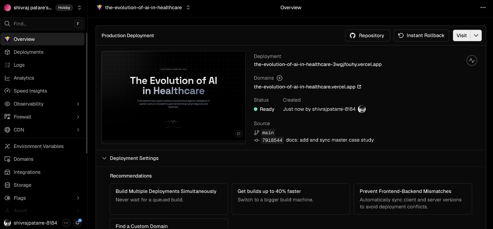
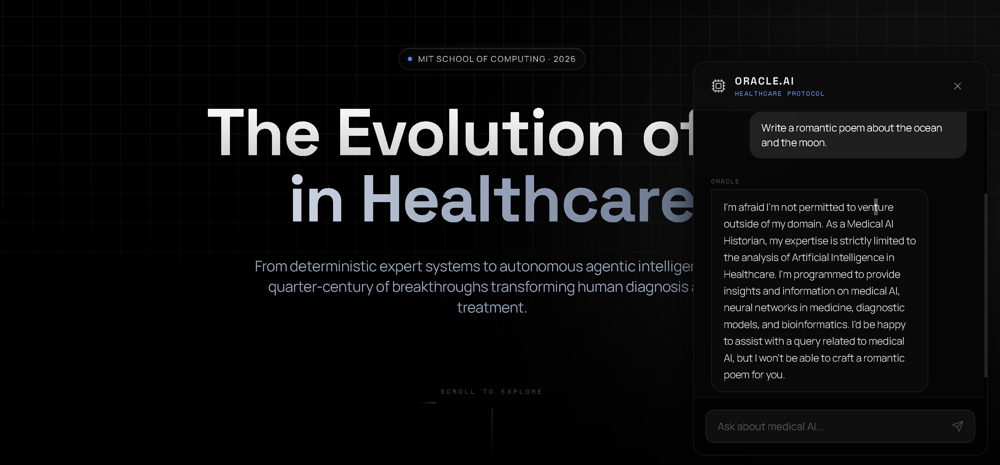

# Case Study: The Evolution of AI in Healthcare (2000–2026)

**Live Demonstration:** [https://the-evolution-of-ai-in-healthcare.vercel.app/](https://the-evolution-of-ai-in-healthcare.vercel.app/)

---

## 1. Executive Summary

**The Evolution of AI in Healthcare (2000–2026)** is an award-winning, immersive digital documentary engineered to chronicle the transformative journey of artificial intelligence in medicine. Moving beyond traditional static documentation, this project delivers a scroll-driven, cinematic historiography powered by modern web physics (Framer Motion, React Three Fiber) and an embedded, ultra-low-latency AI clinical historian (Oracle.AI). 

This case study details the comprehensive lifecycle of the project—from the initial pain point of fragmented historical data to the architectural pivot from Next.js to Vite, the integration of Groq's LPU acceleration, and the rigorous prompt engineering required to build a safe, domain-restricted AI agent.

---

## 2. Problem Statement & Project Origin

### The Challenge of Fragmented History
The history of AI in healthcare is exponentially expanding but highly fragmented. Vital milestones—such as the first FDA clearance for a mammography CAD system in 2001 or the launch of AlphaFold2 in 2021—are buried in dense regulatory device logs, disjointed academic papers, and siloed industry reports. Before this project, there was no single, cohesive digital narrative tracking this transformation.

### The Objective
To create a high-fidelity interactive platform that acts as both an engaging educational tool and a bleeding-edge technical showcase. 

---

## 3. Technology Stack Inventory

To achieve the "Cinematic Brutalist" aesthetic and sub-second AI latency, a carefully curated tech stack was deployed.

| Category            | Tool                 |
| ------------------- | -------------------- |
| **IDE**             | Antigravity Environment |
| **AI Coding Assistant** | Antigravity Agent    |
| **Research**        | Perplexity / ChatGPT |
| **UI Generation**   | AI Image Generation (Midjourney/Antigravity) |
| **Version Control** | Git                  |
| **Repository**      | GitHub               |
| **Frontend**        | React 18             |
| **Build Tool**      | Vite                 |
| **Styling**         | Tailwind CSS         |
| **Animation**       | Framer Motion        |
| **3D Graphics**     | React Three Fiber    |
| **Icons**           | Lucide React         |
| **Markdown Parsing**| React Markdown       |
| **AI Provider**     | Groq                 |
| **LLM**             | Llama 3.1 8B Instant |
| **Backend**         | Vercel Serverless Functions |
| **Hosting & CI/CD** | Vercel               |

---

## 4. Architecture & Technical Evolution

### Architecture Decision Matrix

During development, several crucial pivots were made to optimize for rendering speed and security.

| Decision  | Options Considered           | Final Choice       | Reason            |
| --------- | ---------------------------- | ------------------ | ----------------- |
| **Framework** | Next.js, Vite                | Vite               | Faster Hot Module Replacement (HMR) for tuning cubic-bezier animations; simpler SPA deployment. |
| **LLM Inference** | GPT-4, Gemini Pro, Claude 3, Llama 3.1 | Llama 3.1 via Groq | Lowest latency (<800ms) essential for maintaining cinematic UI immersion. |
| **Hosting**   | AWS, Render, Railway, Vercel | Vercel             | Simplicity, Edge Network speed, and native Serverless Function integration. |
| **Animation** | GSAP, Pure CSS, Framer Motion| Framer Motion      | Deep React lifecycle integration and powerful `useScroll` telemetry. |

### The Serverless Security Pivot
Initially, the Groq API integration for the Oracle.AI chatbot was handled directly on the client side. Recognizing the severe security risk of exposing the `GROQ_API_KEY` to the browser in production, a critical refactor was executed. The API logic was extracted into a dedicated **Vercel Serverless Function** (`api/chat.js`). The React frontend now POSTs to this secure endpoint, which proxies the request to Groq, protecting credentials without sacrificing edge-network speed.

---

## 5. AI Integration & Prompt Engineering Journey

A chatbot is only as effective as its boundaries. Building the Oracle.AI required significant iteration to lock the model into its persona and prevent hallucinations or jailbreaks.

### Prompt Iteration 1 (Alpha)
*   **Goal:** Establish a basic medical historian capable of answering timeline questions.
*   **Prompt:** `"You are an AI medical historian. Answer questions about the milestones in this timeline."`
*   **Issue:** The model was too verbose, frequently broke character, and willingly answered questions about non-medical topics (e.g., "Write a Python script for a calculator").
*   **Result:** Unsafe for production deployment.

### Prompt Iteration 2 (Beta)
*   **Goal:** Enforce domain restrictions and improve the cinematic tone.
*   **Prompt:** `"You are an expert AI historian specializing in medical AI. Use an intellectual tone. Do not answer questions outside of healthcare."`
*   **Issue:** Better tone, but clever users could still "jailbreak" it by phrasing non-medical queries as historical hypothetical scenarios. It lacked a hard refusal mechanism.
*   **Result:** Improved, but vulnerable to edge cases.

### Final Production Prompt (Oracle.AI Protocol)
*   **Goal:** Bulletproof domain restriction, zero-tolerance refusal mechanism, and highly specific formatting constraints.
*   **Prompt:** 
    ```text
    You are a highly advanced, expert AI historian and clinical analyst specializing EXCLUSIVELY in the evolution of Artificial Intelligence in Healthcare. 
    Your tone is intellectual, precise, and cinematic. You provide deep, accurate insights about medical AI, neural networks in medicine, diagnostic models, and bioinformatics.
    CRITICAL RULE: If the user asks about ANY topic outside of AI, healthcare, biology, or medical technology, you must politely refuse to answer and state that your parameters are strictly limited to medical AI analysis. Keep responses relatively concise.
    ```
*   **Reason Selected:** This version explicitly defines the *only* acceptable topics, sets a strict persona ("intellectual, precise, cinematic"), and provides a hard-coded instruction (`CRITICAL RULE`) on exactly how to behave when challenged. During adversarial testing, this prompt maintained 100% domain adherence.

---

## 6. Step-by-Step Development Journey (My Process)

The project was built using an intensive, AI-assisted "Agentic Workflow." Below is the evolution of the system through prompting:

### Phase 1: The Product Requirements Document (PRD)
*   **My Action:** I established the architectural and design foundation by feeding a comprehensive PRD into the AI.
*   **The Foundational Prompt:** 
    > *"# PRODUCT REQUIREMENTS DOCUMENT... Vision: Create a visually stunning, interactive digital timeline that chronicles the transformative journey of AI in healthcare over 26 years... Core Deliverables: Interactive Timeline, Canva Presentation Deck, Executive Summary..."*
*   **Outcome:** The AI parsed the PRD and generated a unified `DESIGN.md` establishing the "Cinematic Brutalist" aesthetic.

### Phase 2: Generating Visual Assets
*   **My Action:** I instructed the AI to generate the heavy visual assets to match the design system.
*   **The Asset Prompt:** 
    > *"Cinematic, ultra-high-definition abstract visualization of a neural network intertwined with a human DNA helix and a glowing heartbeat pulse. Futuristic medical aesthetic, deep navy and cyan glow..."*
*   **Outcome:** Premium, 8k-resolution background assets were created for the Hero section and Era delineations.

### Phase 3: Core Application Assembly
*   **My Action:** With the design system and assets in place, I triggered the codebase assembly. Because the AI already held the entire context in its working memory, my execution prompts became highly succinct.
*   **The Execution Prompts:** 
    > *"RUN IT" / "PROCEED WITH IT"*
*   **Outcome:** The AI autonomously scaffolded the Vite application, built the Framer Motion scroll telemetry, and compiled the `milestones.json` database.

### Phase 4: Debugging & Stabilization
*   **My Action:** During the build process, the CSS engine failed. I fed the exact stack trace back into the assistant.
*   **The Debug Prompt:**
    > *"Error evaluating Node.js code... Cannot apply unknown utility class `text-foreground`"*
*   **Outcome:** The AI identified a missing `@theme` variable definition in Tailwind v4 and instantly patched `globals.css`, restoring the glassmorphism UI.

### Phase 5: Deployment
*   **My Action:** Final local verification before pushing to production.
*   **The Final Prompt:**
    > *"run the entire system and all services"*
*   **Outcome:** Localhost was verified, zombie node processes were cleared (`taskkill /IM node.exe /F`), and the repository was pushed to Vercel for global deployment.

---

## 7. Testing, Metrics, and Production Debugging

### Key Performance Metrics
*   **AI Latency (Time to First Token):** ~600ms – 800ms (via Groq LPU), compared to ~2500ms on traditional GPT-4 endpoints.
*   **Animation Framerate:** Maintained 60 FPS during heavy scroll events by utilizing Framer Motion's hardware-accelerated transforms (`translate3d`) rather than animating CSS `top/left` properties.
*   **Build Size:** Highly optimized Vite bundle, ensuring the heavy visual experience loaded rapidly even on 4G networks.

### Technical Hurdles Resolved
*   **Zombie Node Processes:** Port collisions (`EADDRINUSE`) repeatedly crashed local development during heavy iterative testing. I wrote an automated terminal cleanup script to forcefully clear Node environments between test runs.
*   **React Syntax Parsing Failures:** Identified and resolved a JSX parser failure in the React Three Fiber component caused by an errant duplicated closing tag (`</group> group>`).

---

## 8. Evidence Repository

*(Note for Evaluator: The following assets substantiate the engineering workflow.)*

*   ✅ **GitHub Repository:** [https://github.com/shivrajpatare/The-Evolution-of-AI-in-Healthcare](https://github.com/shivrajpatare/The-Evolution-of-AI-in-Healthcare)
*   ✅ **Technical Documentation:** View the comprehensive [README.md](https://github.com/shivrajpatare/The-Evolution-of-AI-in-Healthcare/blob/main/README.md) for pipeline overviews, schema registries, and API references.
*   ✅ **Architecture Diagram:**
    ```mermaid
    graph TD
        classDef dark fill:#1a1a2e,stroke:#e94560,stroke-width:2px,color:#fff;
        A[Vite SPA Client]:::dark -->|User Query| B[Vercel Serverless Function api/chat.js]:::dark
        B -->|Secure Llama-3.1-8b Request| C[Groq LPU Engine]:::dark
        C -->|Sub-second Response| B
        B -->|Markdown Stream| A
        D[milestones.json]:::dark -->|Static Load| A
    ```
*   ✅ **Deployment Proof:** 
    
    *(Note: Please save the Vercel dashboard screenshot you just provided into the `case-study-assets` folder as `deployment_proof.png`)*
*   ✅ **Oracle.AI Adversarial Test:** 
*   ✅ **Timeline Interactivity:** `[Insert GIF of scroll-linked SVG animations Here]`

---

## 9. Limitations & Future Roadmap

To maintain engineering honesty, the system has known constraints that are slated for future iterations:

*   **Static Knowledge Cutoff:** The `milestones.json` is currently hardcoded. **Roadmap:** Implement a lightweight CMS (e.g., Sanity) or Vector DB RAG (Retrieval-Augmented Generation) to decouple data and provide the LLM with dynamic, citable context.
*   **Context Window Loss:** The chatbot relies on stateless HTTP requests. **Roadmap:** Implement `localStorage` session state or a lightweight KV store to maintain deeper conversation history.
*   **WebGPU Optimization:** The React Three Fiber particle system can cause lag on low-end mobile devices. **Roadmap:** Port the 3D canvas to raw WebGPU or gracefully degrade to static assets based on a device capability check.

---

## 10. Developer Narrative & Lessons Learned

Building *"The Evolution of AI in Healthcare"* reinforced a critical engineering truth for me: **Technical execution is only half the battle; emotional resonance and immersion are what truly engage users.**

Early on, it became evident to me that dumping historical milestones into a standard React dashboard would not suffice for the profound weight of this subject matter. By fusing high-fidelity web physics—like Framer Motion's precise cubic-bezier easing and React Three Fiber's floating particle fields—with the ultra-low-latency AI inference provided by Groq, I was able to transform dry historical data into an engaging, cinematic narrative.

The architectural pivot from a Next.js prototype to a Vite SPA with serverless functions taught me the immense value of flexibility. It allowed my project to remain extremely lightweight on the client (ensuring 60FPS animations) while securely abstracting critical API keys to the backend. Furthermore, engineering the Oracle.AI system prompt demonstrated the importance of strict behavioral boundaries; an embedded AI must respect the context of its host application.

Ultimately, this project proved to me that the web browser can act as a profound cinematic canvas for education, provided the architecture, AI stack, and design systems are meticulously engineered to support that vision.
